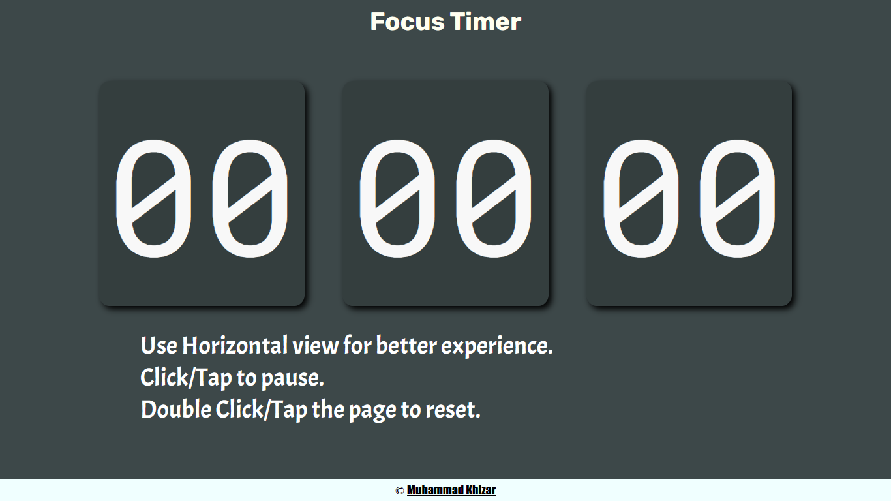

 

  

<h3 align="center" >Focus Timer</h3>

  A simple Timer for you to focus on you goals...
   
  <a href="https://github.com/MKhizar51/focus-timer"><strong>Explore the docs »</strong></a>
   
   
  <a href="https://github.com/MKhizar51/focus-timer/issues">Report Bug</a>
    ·
    <a href="https://github.com/MKhizar51/focus-timer/issues">Request Feature</a>
  

<!-- TABLE OF CONTENTS -->

Table of Contents

  <ol>
    <li>
      <a href="#about-the-project">About The Project</a>
      <ul>
        <li><a href="#features">Features</a>
        <li><a href="#built-with">Built With</a></li>
      </ul>
    </li>
    <li><a href="#installation">Installation</a></li>
    <li><a href="#usage">Usage</a></li>
    <li><a href="#how=to-contribute">How to Contribute</a></li>
    <li><a href="#license">License</a></li>
    <li><a href="#contact">Contact</a></li>
    <li><a href="#acknowledgments">Acknowledgments</a></li>
  </ol>

<h1 id='about-the-project'> About the Project</h1>

**Focus Timer** is a simple web Stopwatch Timer to help you focus during the tasks. It is made with simple design and contols so you can easily focus on your **tasks** instead of **Timer**.
 
 

(<a href="#readme-top">back to top</a>)

<h2 id='features'> Features</h2>

It has multiple **Features** like:-

- Simple Design
- Easy to Use
- Start/Stop/RESET function
- Responsive Design

- Visual Support

(<a href="#readme-top">back to top</a>)

<h2 id='built-with'>Built With</h2>

Tasbeeh Calculator is built using technologies:-

(<a href="#readme-top">back to top</a>)

<h2 id='installation'>Installation</h2>

1. Clone the repository: `git clone https://github.com/MKhizar51/focus-timer.git`

2. Open the project in Visual Studio Code
3. Open `index.html` in your browser

<h2 id='usage'>Usage</h2>

- Just Click/Tap anywhere to START.
- Click/Tap anywhere to STOP.

- Double Click/Tap to RESET.

(<a href="#readme-top">back to top</a>)

<h2 id='how=to-contribute'>How to Contribute</h2>

We welcome contributions from the community! If you would like to contribute to Focus Timer, please follow these steps:

1. Fork the repository

2. Create a new branch: `git checkout -b my-new-feature`
3. Make changes and commit: `git commit -am 'Add some feature'`
4. Push to the branch: `git push origin my-new-feature`
5. Submit a pull request

(<a href="#readme-top">back to top</a>)

<h2 id='license'>License</h2>

This project is licensed under the **MIT License**. See the [LICENSE](https://github.com/MKhizar51/focus-timer/blob/main/LICENSE) file for details.

(<a href="#readme-top">back to top</a>)

<h2 id='contact'>Contact</h2>

Your Name - khizarr912@gmail.com

Project Link: [https://github.com/MKhizar51/focus-timer](https://github.com/MKhizar51/focus-timer)

(<a href="#readme-top">back to top</a>)

<h2 id='acknowledgments'>Acknowledgments</h2>

- [Choose an Open Source License](https://choosealicense.com)
- [Img Shields](https://shields.io)
  
- [GitHub Pages](https://pages.github.com)
- [README Template](https://github.com/othneildrew/Best-README-Template)

(<a href="#readme-top">back to top</a>)

